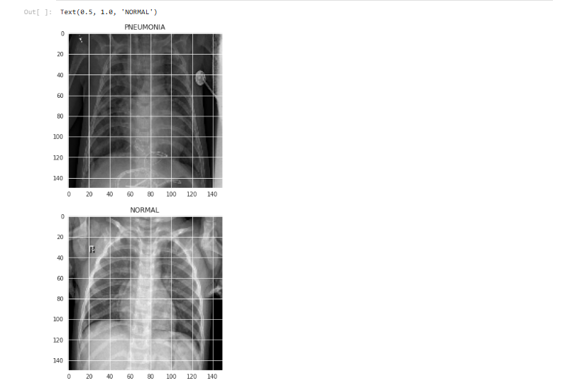
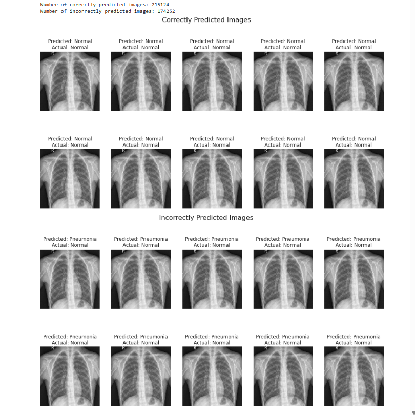

# Pneumonia Detection Using CNN

## Overview
This repository contains a Convolutional Neural Network (CNN) model for detecting pneumonia from chest X-ray images. The model achieves an accuracy of 92.6%, making it a reliable tool for aiding in pneumonia diagnosis.

## Features
- **Deep Learning Model:** Utilizes a CNN architecture for image classification.
- **Dataset:** Works with a dataset of chest X-ray images.
- **High Accuracy:** Achieves a classification accuracy of 92.6%.
- **Easy to Use:** Provided as a Jupyter Notebook for easy replication and understanding.

## Requirements
To run this project, you'll need the following:

### Python Libraries
- TensorFlow
- Keras
- NumPy
- Matplotlib
- Scikit-learn

### Hardware Requirements
- A system with a GPU is recommended for faster training and inference.

## Dataset
The dataset consists of chest X-ray images categorized into two classes:
- **Normal:** X-rays of healthy individuals.
- **Pneumonia:** X-rays of individuals diagnosed with pneumonia.

You can download the dataset from [Kaggle](https://www.kaggle.com/datasets) or use your preferred source of chest X-ray images.

## Usage
1. Clone the repository:
   ```bash
   git clone https://github.com/<your-username>/pneumonia-detection-cnn.git
   ```

2. Install the required Python libraries:
   ```bash
   pip install -r requirements.txt
   ```

3. Download and organize the dataset in the following directory structure:
   ```plaintext
   dataset/
   ├── train/
   │   ├── NORMAL/
   │   └── PNEUMONIA/
   └── test/
       ├── NORMAL/
       └── PNEUMONIA/
   ```

4. Open the Jupyter Notebook file:
   ```bash
   jupyter notebook pneumonia-detection-using-cnn-92-6-accuracy.ipynb
   ```

5. Follow the steps in the notebook to preprocess the data, train the model, and evaluate its performance.

## Model Architecture
The CNN model consists of the following layers:
- Convolutional Layers: Extract features from input images.
- Pooling Layers: Reduce dimensionality while retaining important features.
- Fully Connected Layers: Perform classification.

The architecture has been fine-tuned to achieve the highest possible accuracy.

## Results
- **Accuracy:** 92.6%
- **Precision, Recall, and F1-Score:** Detailed metrics available in the notebook.

### Sample Results
Below are some sample results showing model predictions on test images:

#### Normal X-Ray Prediction vs Pneumonia X-Ray Prediction



#### Resulta


## Contribution
Contributions are welcome! Feel free to submit a pull request or open an issue if you find any bugs or want to suggest improvements.

## License
This project is licensed under the MIT License. See the [LICENSE](LICENSE) file for details.

## Contact
For any queries, please reach out to:
- **Name:** Tanisi Jha
- **Email:** [Your Email Here]
- **GitHub:** [Tanisi1234](https://github.com/Tanisi1234)

---

### Acknowledgments
- Kaggle for providing the dataset.
- TensorFlow and Keras for the deep learning framework.

